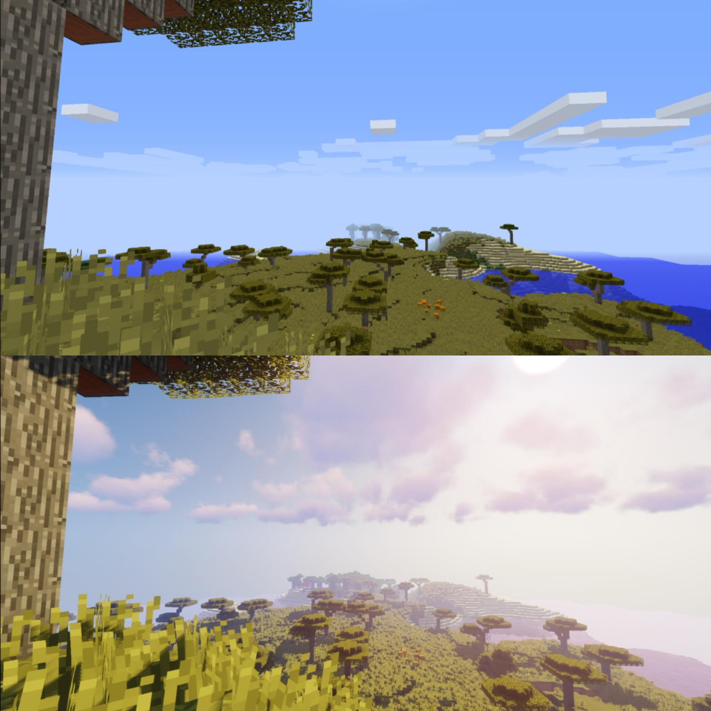
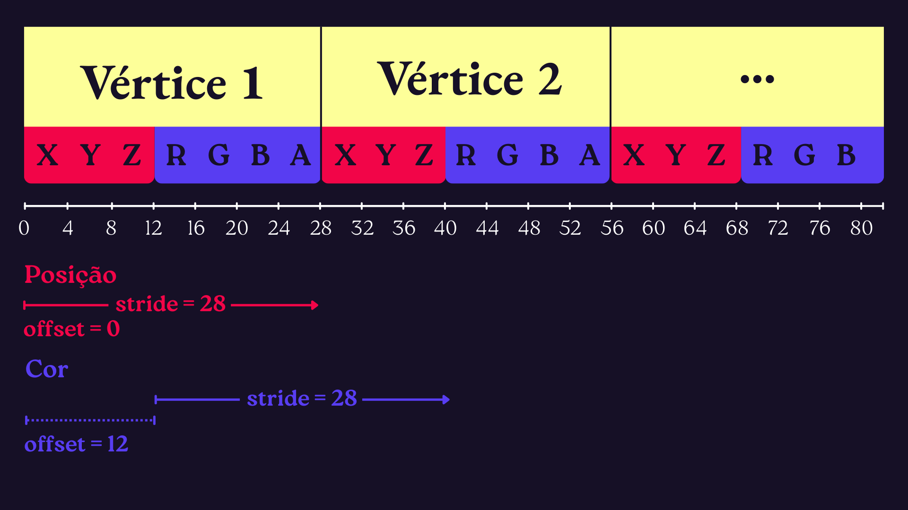
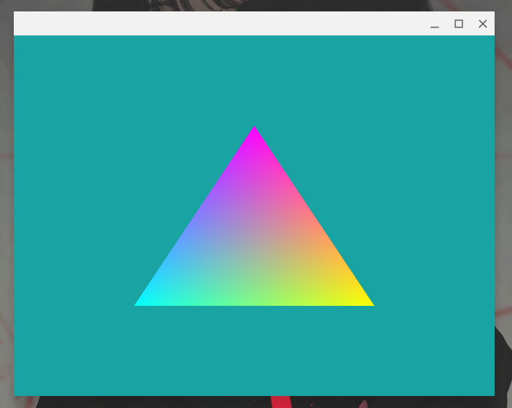

# Shaders

A maioria das pessoas que conhecem a palavra **shader** passaram a conhecer por conta do bom e velho Minecraft. Se você já jogou um pouco de Mine, provavelmente em algum momento se deparou com vídeos no youtube mostrando o jogo com gráficos "realistas" e foi atrás de conseguir esse upgrade também. Entretanto, seu computador tinha 1GB de RAM e uma placa de vídeo integrada, então deu tudo errado e foi aí que você adquiriu consciência de classe. Neste contexto, shaders são "mods que deixam o jogo mais bonitinho". Aqui em baixo temos uma comparação do visual do Mine sem e com shaders, e a diferença que eles fazem realmente pode ser gigante. Contudo, mesmo entre programadores, muita gente não sabe o que **realmente** é um shader. É isso que vamos entender neste capítulo.



No fim deste capítulo, você saberá o beabá do **GLSL**: a linguagem que usamos para escrever shaders. A lista mais completa do que vamos ver é:

1. O que é um shader
2. O que é o GLSL
3. Tipos no GLSL
4. Variáveis In e Out
5. Uniforms
6. Layout e múltiplos atributos de vértice
7. Programas
8. Criação de uma classe para lidar com shaders

## O que é um shader

Como já dissemos brevemente no capítulo anterior, um shader nada mais é do que um programa que roda na GPU. Os shaders serão parte fundamental dos nossos programas na computação gráfica, pois geralmente serão com eles que manipularemos a geometria e a cor de uma cena.

Pense comigo, uma cena em um jogo de computador ou uma simulação física pode ter **milhões** ou até mesmo **_BILHÕES_** de vértices. Não importa o quão boa seja a sua CPU, ela jamais conseguiria processar a quantidade absurda de informação contida nesses vértices em tempo real (em 16ms por exemplo, para um programa rodando a 60fps). Contudo, GPUs são processadores altamente paralelizados, eles possuem centenas ou até mesmo milhares de vezes mais núcleos do que uma CPU. Além disso, eles possuem unidades de hardware especificamente projetadas para realizar os tipos de cálculo mais comuns no processo de renderização - operações com vetores e matrizes.

Por conta deste alto grau de paralelismo que é característico das GPUs, programar um shader é significativamente diferente de se programar um software convencional. Quando escrevemos um vertex shader, por exemplo, este programa será executado uma vez para cada vértice, sendo que nós não teremos acesso aos dados de nenhum outro vértice. O mesmo vale para um shader de fragmento, ele rodará uma vez para cada fragmento, sem saber nada sobre nenhum outro fragmento.

Existem muitos tipos de shaders, que juntos compõem boa parte da pipeline de renderização. No entanto, como você já deve estar sabendo, os dois tipos de shader que mais nos interessam neste curso são o shader de vértice e o shader de fragmento, então bora entender um pouco melhor para que serve cada um deles.

### Vertex shader

O shader de vértices é basicamente o primeiro passo da pipeline, ele recebe os dados brutos em sua forma inicial, como por exemplo:

- Posição dos vértices
- Cor dos vértices
- Vetores normais
- Etc

E então, sua função é no mínimo calcular as coordenadas normalizadas dos vértices (as **_NDCs_**; `Normalized Device Coordinates`) - que serão retornados como output utilizando uma variável especial chamada `gl_Position`, como veremos em breve.

> As NDCs são coordenadas cujos valores estão no intervalo `[-1, 1]`. Por exemplo, o vetor `<0, 2, -1>` não é uma NDC, mas o vetor `<-0.5, 1, 0>` é.

Contudo, além de calcular as NDCs, você pode fazer qualquer tipo de processamento dos atributos recebidos como input antes de repassá-los para os estágios seguintes da pipeline. Um tipo de processamento básico (e que veremos em um próximo capítulo) é a transformação da posição dos vértices entre diferentes espaços.

### Fragment shader

Entre o shader de vértices e o shader de fragmento, os primitivos do OpenGL são transformados em fragmentos (essencialmente "pontinhos" no espaço, que serão tratados como candidatos a pixel). Sendo assim, a função do shader de fragmento é decidir qual será a cor final que um fragmento assumirá. Com o conhecimento e as técnicas certas, este conceito relativamente simples pode ser levado a grandes extremos, gerando visuais de outro mundo. Esta imagem abaixo, por exemplo, foi gerada com um [shader de fragmento](https://www.shadertoy.com/view/MdX3Rr) escrito pelo lendário [Inigo Quilez](https://iquilezles.org/)


No geral, também é no shader de fragmento que fazemos a maior parte do trabalho de iluminação de uma cena.

-----

Resumindo...

- O shader de vértices recebe os atributos de um vértice e cospe sua NDC (e outros dados arbitrários e não obrigatórios).
- O shader de fragmentos recebe os dados de um fragmento e devolve a sua cor.

Se isso ainda estiver meio abstrato, não precisa se preocupar, mexendo mais com eles você vai entender melhor.

## O que é o GLSL

[GLSL](https://wikis.khronos.org/opengl/Core_Language_(GLSL)) é uma sigla para "**_OpenGL Shading Language_**", ou seja, a linguagem de shaders do OpenGL.

O GLSL é possui uma sintaxe muito parecida com a do C (e de quebra com a do C++), portanto a adaptação para essa linguagem não é muito difícil. Um programa escrito com ele tem mais ou menos essa cara:

``` GLSL
#version 430
in type input_1;
in type input_2;

out type output_1;
  
uniform type uniform_1;
  
void main()
{
  // Faz as paradas de shader
  ...
  // Gera um output
  output_1 = alguma_coisa;
}
```

Na primeira linha, estamos definindo qual versão do GLSL estamos usando com uma diretiva de pré-processamento. As versões do GLSL vão sendo atualizadas para acompanhar as mudanças introduzidas no OpenGL, então neste curso estaremos usando o `GLSL 4.30`, mas provavelmente não usaremos nenhum recurso que não seja compatível também com versões mais antigas até a `3.30`.

Depois, estamos dizendo quais são os **inputs**, **outputs** e **_uniforms_** do nosso programa (explicaremos o que são _uniforms_ em breve). Por fim, definimos a função `main`, assim como em qualquer programa em C(++). No fim do main, depois de vazer todos os cálculos e processamentos necessários, definimos o valor dos outputs que serão passados para os próximos estágios da pipeline.

> Uma coisa bacana do GLSL é que ele vem com algumas variáveis e funções muito úteis embutidas na linguagem. Você pode ver uma lista das variáveis e funções nas páginas 7, 8 e 9 deste [card de referência](https://www.khronos.org/files/opengl43-quick-reference-card.pdf).

Sem mais delongas, vamos para o prato principal

## Tipos no GLSL

Além dos tipos primitivos e derivados que já vemos no C, como `int`, `float`, `double`, `bool`, `void`, estruturas e arrays, também temos alguns tipos para representar vetores, matrizes e texturas.

Os tipos que representam vetores têm nome `vecn`, onde `n` é substituído por `2`, `3` ou `4`, representando o número de componentes no vetor. Além disso, podem possuir um prefixo `i`, `b`, `d` ou `u` que modifica o tipo dos componentes do vetor, que por padrão são um `float`:

- `vecn`: vetor de pontos flutuantes com n componentes
- `ivecn`: vetor de inteiros com n componentes
- `uvecn`: vetor de inteiros sem sinal com n componentes
- `bvecn`: vetor de booleanos com n componentes
- `dvecn`: vetor de pontos flutuantes de dupla precisão com n componentes

Ou seja, se quisermos um vetor de `double` com 3 componentes, escrevemos `dvec3`, já um vetor de inteiros com 2 componentes é um `ivec2`, e assim em diante.

Os tipos para representar matrizes são bem parecidos, eles tem formato `matnxm`, onde `n` e `m` são o número de colunas e linhas, respectivamente. As matrizes também podem ter um prefixo `d` para indicar que seus componentes são do tipo `double`. Logo, uma matriz de `float` com 3 colunas e 2 linhas é escrita como `mat3x2`, e uma matriz de `double` com 4 colunas e 4 linhas é escrita como `dmat4x4`.

Já para representar texturas existem muitos tipos, mas no geral usaremos os tipos `sampler1D`, `sampler2D` ou `sampler3D`, onde o final indica a dimensão da textura.

### Manipulando vetores e matrizes

Para inicializar um vetor no GLSL, usamos uma função que possui o mesmo nome que o tipo de vetor que estamos criando, assim:

``` GLSL
vec3 vetorzao = vec3(1.2, 3.0, -0.5);
```

Algo _muito massa_, no entanto, é que os argumentos não precisam ser passados componente por componente, você pode reaproveitar componentes de um outro vetor, por exemplo:

``` GLSL
vec3 vetorzao = vec3(1.2, 3.0, -0.5);
vec4 megavetorzao = vec4(vetorzao, 1.0); // Isso criará um vetor <1.2, 3.0, -0.5, 1.0>
```

Outra coisa **ainda mais massa** é algo chamado **_swizzling_**, que basicamente se consiste em usar o "apelido" de um componente para se referir a ele. É mais fácil mostrar do que explicar, então antes disso só vou dizer quais são os apelidos pelos quais você pode chamar os componentes de um vetor:

- `x, y, z, w`: geralmente usado para coordenadas no espaço
- `r, g, b, a`: usado para cores
- `s, t, p, q`: usado para coordenadas de uma textura

onde `x`, `r` e `s` se referem ao primeiro componente de um vetor, `y`, `g` e `t` se referem ao segundo componente, e assim em diante. Veja como isso pode ser usado:

``` GLSL
vec3 coord = vec3(1.0, 2.0, 3.0);
vec4 novaCoord = coord.xyxz; // Resultado: <1.0, 2.0, 1.0, 3.0>

vec4 cor = vec4(0.2, 0.4, 0.8, 1.0);
vec4 novaCor = vec4(cor.rgb, 0.5); // Resultado: <0.2, 0.4, 0.8, 0.5>

vec2 texCoord = vec2(0.5, 0.1);
vec3 novaTexCoord = vec3(texCoord.ts, 0.6); // Resultado: <0.1, 0.5, 0.6>
```

Mucho loco né? Nós podemos combar à vontade o swizzling com o fato de que os construtores de vetores podem receber vetores como argumento, além de sair embaralhando os componentes como quisermos.

Inicializar matrizes não é muito diferente, o que você precisa saber é que por convenção os elementos passados como argumento formarão a matriz coluna por coluna, da esquerda para a direita:

``` GLSL
mat2x2 matriz = mat2x2(1.0, 2.0, 3.0, 4.0);
// Resultado:
// 1.0   3.0
// 2.0   4.0

vec3 col1 = vec3(1.0, 2.0, 3.0);
vec3 col2 = vec3(4.0, 5.0, 6.0);
vec3 col3 = vec3(7.0, 8.0, 9.0);
mat3x3 outraMatriz = mat3x3(col1, col2, col3);
// Resultado:
// 1.0   4.0   7.0
// 2.0   5.0   8.0
// 3.0   6.0   9.0

// Se você passar só um argumento escalar para um construtor de matriz,
// o GLSL colocará esse número em todos os elementos da diagonal principal
mat3x3 matrizDiagonal = mat3x3(2.0);
// Resultado:
// 2.0   0.0   0.0
// 0.0   2.0   0.0
// 0.0   0.0   2.0
```

Outra coisa bacana do GLSL é que ele suporta adição e subtração entre vetores e entre matrizes nativamente, sem precisar de funções auxiliares. A multiplicação de vetores e matrizes com escalares, ou de matrizes com vetores, também é suportada:

``` GLSL
vec3 meuVetor = vec3(1.0, 2.0 3.0);
mat3x3 minhaMatriz = mat3x3(2.0);
float meuEscalar = 3.0;

vec3 somaVetores = meuVetor - meuVetor.xxx; // Resultado: <0.0, 1.0, 2.0>
vec3 multVetorMatriz = minhaMatriz * meuVetor; // Resultado: <2.0, 4.0, 6.0>
mat3x3 multMatriz = meuEscalar * minhaMatriz;
// Resultado:
// 6.0   0.0   0.0
// 0.0   6.0   0.0
// 0.0   0.0   6.0
```

Enfim, tem outras combinações aí das operações mas você já sacou o que importa...

## Variáveis In e Out

As palavra-chave `in` indica uma variável de input, um parâmetro que muda a cada vez que o shader é chamado - ou seja, atributos de vértices ou de fragmentos. Já a palavra-chave `out` indica uma variável de output que um shader passará para os próximos estágios da pipeline.

Nós definimos `ins` e `outs` assim:

``` GLSL
layout (location = 0) in vec3 aPos;
layout (location = 1) in vec4 aCor;

out float algumDado;
```

O `layout (location = N)` não é obrigatório nos inputs, mas eles nos ajudam lá no C++ a saber a posição desses atributos sem precisar perguntar para o OpenGL. Contudo, caso você omita essa parte, pode descobrir a `location` de um input usando a função `glGetAttribLocation`, passando como primeiro argumento o programa onde este shader está e como segundo argumento o nome do atributo, como `"aPos"`.

Para definir o valor dos atributos de input, usamos VAOs e VBOs em conjunto com as funções `glVertexAttribPointer` e `glEnableVertexAttribArray` como vimos no último capítulo. 

Os outputs precisam ter seus valores definidos em algum momento da execução do shader, geralmente no final do main:

``` GLSL
void main() {
    // Faz muitas contas
    ...
    algumDado = resultadoDasContas;
}
```

## Uniforms

Se os `in` são atributos de input que mudam para cada chamada do shader, os **_uniforms_** são variáveis globais a um programa. Em outras palavras, são inputs "constantes"; você até pode mudar o valor deles na sua aplicação C++, mas o valor deles não está associado a um vértice ou fragmento, é igual para todos eles.

Os uniforms podem ser usados, por exemplo, para definir a cor ou a posição de uma fonte de iluminação, como faremos em um capítulo futuro. Não importa que vértice ou fragmento você está processando, a cor da luz que afeta ele é sempre a mesma, saca? A cor do sol, por exemplo.

Para declarar um uniform nós usamos a palavra-chave `uniform` (( ˶°ㅁ°) !!).

``` GLSL
uniform vec4 corConstante;
```

E para definir o seu valor, precisamos trabalhar com "duas" funções (uma delas possui muitas variantes, por isso as aspas). A primeira é o `glGetUniformLocation`, para descobrir a localização do uniform, analogamente ao que vimos com os atributos de input. A segunda é o `glUniform*` para definir de fato o valor, onde o asterisco depende pesadamente do tipo do uniform, podendo ser por exemplo `2i`, `3fv`, `Matrix2x3f`, dentre inúmeras outras opções.

> O formato do `*` é basicamente que primeiro vem um número que indica quantos componentes tem o tipo (ou seja, pode ser de 1 a 4), depois vem uma letra que indica o tipo dos componentes (podendo ser `f`, `i` ou `ui`), e no fim pode ou não ter um `v`, indicando que o uniform é um vetor. No caso de matrizes, o asterisco é substituído pelo tipo da matriz por extenso, com um `fv` no final. Saiba mais sobre [aqui](https://docs.gl/gl4/glUniform)

Aqui está o código de como definiriamos o uniform `corConstante` do exemplo acima:

``` GLSL
int corConstLocation = glGetUniformLocation(program, "corConstante");
glUniform4f(corConstLocation, 0.94f, 0.14f, 0.21f, 1.0f);
```

## Layout e múltiplos atributos de vértice

Como vimos agora pouco, quando temos múltiplos atributos de vértice (inputs do vertex shader), nos serve bem utilizar a sintaxe `layout (location = N)`, mas como isso interage com o que temos feito no C++ e OpenGL?

Bom, no último capítulo, estavamos lidando com apenas uma propriedade por vértice: a sua **posição**. Contudo, nada nos impede de definir vários atributos de vértice com diferentes significados. Neste caso aqui iremos definir que cada vértice possui uma cor associado a ele.

Primeiro, modifique as entradas do vertex shader que escrevemos no último capítulo para declarar esse `in`:

``` GLSL
layout (location = 0) in vec3 aPos;
layout (location = 1) in vec4 aCor;
```

Depois, vamos definir a cor de cada vértice junto daquela array de posições, lá no C++

``` GLSL
float vertices[] = {
    // posicoes          // cores
     0.5f, -0.5f, 0.0f,  1.0f, 1.0f, 0.0f, 1.0f,
    -0.5f, -0.5f, 0.0f,  0.0f, 1.0f, 1.0f, 1.0f,
     0.0f,  0.5f, 0.0f,  1.0f, 0.0f, 1.0f, 1.0f
};
```

Lembra que antes nós estavamos assumindo que os dados das posições estavam perfeitamente agrupados? Bom, agora não estão mais, as posições dos vértices e as cores estão intercaladas, como nessa imagem:



Logo, precisaremos dizer isso para o OpenGL usando a função `glVertexAttribPointer`, modificando nossa chamada antiga dessa função para essas duas chamadas aqui (uma para cada atributo):

``` C
// Configurações do atributo de posição:
// -> 0 é a localização dele, como definimos no shader
// -> 7 * sizeof(float) = 28 bytes, é o nosso stride
// -> (void*)0 é o nosso offset, já que as posições começam logo no início da array
glVertexAttribPointer(0, 3, GL_FLOAT, GL_FALSE, 7 * sizeof(float), (void*)0);
glEnableVertexAttribArray(0);

// Configurações do nosso atributo de cor:
// -> 1 é a localização dele, como definimos no shader
// -> o stride é o mesmo: 7 * sizeof(float) = 28 bytes
// -> (void*)(3 * sizeof(float)) = 12 bytes, é o nosso offset considerando os 3 floats da posição
glVertexAttribPointer(1, 4, GL_FLOAT, GL_FALSE, 7 * sizeof(float), (void*)(3 * sizeof(float)));
glEnableVertexAttribArray(1);
```

Agora que estamos passando um atributo de cor para o shader de vértice, precisamos fazer algo com ele, se não nossa vida perde o sentido. O que vamos fazer por enquanto é simplesmente repassar esse valor para o shader de fragmento. Assim, o valor da cor de cada vértice será interpolado durante a rasterização que gera os fragmentos do nosso triângulo, e nós poderemos capturar esse valor no shader de fragmento com o uso de uma variável `in`. Isso causará o efeito de um degradê bem bacana e icônico.

Primeiro, então, modifique o vertex shader para incluir essa variável de output:

``` GLSL 
out vec4 cor;

void main() {
    // Repassando a cor para o fragment shader
    cor = aCor;
    gl_Position = vec4(aPos, 1.0);
}
```

E então capture a variável `cor` no shader de fragmento (é importante que o `in` do shader de fragmento tenha o mesmo nome do `out` do shader de vértices).

``` GLSL
in vec4 cor;

void main() {
    FragColor = cor;
}
```

Pronto, rode nosso programa e você verá um resultado como esse :)



## Programas

Outra coisa que não explicamos muito bem no último capítulo (para não sobrecarregá-lo) é o conceito de um **_programa_**. O nome desse conceito é um tanto quanto infeliz, pois nós já temos um conceito de "programa" definido em nossa mente. Contudo, no OpenGL um programa é um objeto que reúne shaders compilados e linkados para serem usados em uma operação de renderização (uma **_draw call_**). Os passos que seguimos para ter um programa pronto e utilizável é o mesmo que já fizemos antes:

1. Criamos shaders com a função `glCreateShader`;
2. Definimos o código fonte de shaders com a função `glShaderSource`;
3. Compilamos shaders com a função `glCompileShader`;
4. Criamos um programa com a função `glCreateProgram`;
5. Inserimos shaders no programa com a função `glAttackShader`;
6. Linkamos os shaders inseridos no programa com a função `glLinkProgram`;
7. Ativamos/usamos o programa com a função `glUseProgram`;
8. Por fim, deletamos os shaders com a função `glDeleteShader`

Os shaders obrigatórios se quisermos ter algum tipo de geometria visível na tela são somente os shaders de vértice e de fragmento que já vimos.

Criar múltiplos programas nos permite alternar entre diferentes conjuntos e combinações de shaders sem precisarmos ficar seguindo todos os passos acima de novo e de novo. Basta criarmos um programa para cada combinação de shaders que queremos usar (claro, sem exagerar no número de programas para não afetar a performance) e então apenas alternar qual está atualmente ativo com o `glUseProgram`.

Apenas para fins ilustrativos e para cementar esse processo na sua memória, aqui está o fluxo padrão da criação de um programa:

``` GLSL
// Shader de vértices
const char *codigoShaderVertices = leCodigoFonteDeAlgumJeito("./shaders/nome_do_shader.vert");
unsigned int shaderVertices;
shaderVertices = glCreateShader(GL_VERTEX_SHADER);
glShaderSource(shaderVertices, 1, &codigoShaderVertices, NULL);
glCompileShader(shaderVertices);

// Repete o processo para o shader de fragmentos...

// Junta tudo em um programa
unsigned int programa;
programa = glCreateProgram();
glAttachShader(programa, shaderVertices);
glAttachShader(programa, shaderFragmentos);
glLinkProgram(programa);
glUseProgram(programa);

// Deleta os shaders, eles já estão no programa então já serviram seu propósito
glDeleteShader(shaderVertices);
glDeleteShader(shaderFragmentos);
```

## Criação de uma classe para lidar com shaders

E se nós usássemos nosso conhecimento de OOP com C++ para criar uma classe que abstraísse parte dessa trabalheira? Ótima ideia! você é incrível.

Primeiramente, vamos declarar o esqueleto de uma classe que basicamente cuidará das partes mais chatinhas do gerenciamento de programas, shaders e uniforms. Em nossa pasta `src`, cria uma nova pasta `modules` e coloque esse código em um arquivo de header `shader.hpp`:

``` cpp
#ifndef SHADER_H
#define SHADER_H

#include <glad/glad.h>

#include <string>

class Shader {
public:
    // ID do programa associado os shaders
    unsigned int ID;

    // O construtor cuida da parte repetitiva de ler arquivo,
    // compilar shaders, linkar, tratar erros, etc
    Shader(const char *verticePath, const char *fragmentoPath);
    // Ativa o shader com o ID ali de cima
    void use();
    // Facilitam a alteração de um valor uniform
    void setBool(const std::string &nome, bool valor) const;
    void setInt(const std::string &nome, int valor) const;
    void setFloat(const std::string &nome, float valor) const;
};

#endif
```

Depois, na mesma pasta, crie um arquivo `shader.cpp` onde iremos definir o corpo dessas funções. Vamos começar com o construtor (que será de longe o método mais longo/complexo). Nosso construtor, como você pode ver, recebe o caminho para os arquivos do vertex shader (VS) e do fragment shader (FS). Com estes caminhos, o construtor irá fazer tudo aquilo na lista da seção anterior e mais: ler os arquivos, criar os shaders, compilar, linkar, pipipi pópópó...

``` cpp

#include "shader.hpp"
#include <fstream>
#include <iostream>
#include <sstream>

Shader::Shader(const char *verticePath, const char *fragmentoPath) {
    // Pegamos os códigos dos shaders e colocamos eles em variáveis
    std::string codigoVS;
    std::string codigoFS;
    std::ifstream arquivoVS;
    std::ifstream arquivoFS;
    arquivoVS.exceptions(std::ifstream::failbit | std::ifstream::badbit);
    arquivoFS.exceptions(std::ifstream::failbit | std::ifstream::badbit);
    try {
        arquivoVS.open(verticePath);
        arquivoFS.open(fragmentoPath);
        std::stringstream streamVS, streamFS;
        // Lendo o conteúdo dos arquivos em streams
        streamVS << arquivoVS.rdbuf();
        streamFS << arquivoFS.rdbuf();

        arquivoVS.close();
        arquivoFS.close();
        // Convertendo as streams em strings
        codigoVS = streamVS.str();
        codigoFS = streamFS.str();
    } catch (const std::ifstream::failure &e) {
        std::cout << "ERROR::SHADER::FILE_NOT_SUCCESFULLY_READ" << std::endl;
    }
    const char *codigoVSbruto = codigoVS.c_str();
    const char *codigoFSbruto = codigoFS.c_str();
    unsigned int vertice, fragmento;
    int sucesso;
    char infoLog[512];

    // Shader de vértice
    vertice = glCreateShader(GL_VERTEX_SHADER);
    glShaderSource(vertice, 1, &codigoVSbruto, NULL);
    glCompileShader(vertice);
    // Tratando um possível erro
    glGetShaderiv(vertice, GL_COMPILE_STATUS, &sucesso);
    if (!sucesso) {
        glGetShaderInfoLog(vertice, 512, NULL, infoLog);
        std::cout << "ERROR::SHADER::VERTEX::COMPILATION_FAILED\n"
                << infoLog << std::endl;
    };

    // Repetindo para o shader de fragmento
    fragmento = glCreateShader(GL_FRAGMENT_SHADER);
    glShaderSource(fragmento, 1, &codigoFSbruto, NULL);
    glCompileShader(fragmento);
    glGetShaderiv(fragmento, GL_COMPILE_STATUS, &sucesso);
    if (!sucesso) {
        glGetShaderInfoLog(fragmento, 512, NULL, infoLog);
        std::cout << "ERROR::SHADER::FRAGMENT::COMPILATION_FAILED\n"
                << infoLog << std::endl;
    };

    // Criando o programa
    ID = glCreateProgram(); // ID é propriedade da própria classe Shader
    glAttachShader(ID, vertice);
    glAttachShader(ID, fragmento);
    glLinkProgram(ID);
    // Checando erros de linkagem
    glGetProgramiv(ID, GL_LINK_STATUS, &sucesso);
    if (!sucesso) {
        glGetProgramInfoLog(ID, 512, NULL, infoLog);
        std::cout << "ERROR::SHADER::PROGRAM::LINKING_FAILED\n"
                << infoLog << std::endl;
    }

    // Limpando os shaders criados
    glDeleteShader(vertice);
    glDeleteShader(fragmento);
}
```

Depois, vamos para os outros métodos, que também não incluem nenhuma novidade, apenas deixam a sintaxe de operações que já vimos anteriormente mais limpa:

``` cpp
void Shader::use() { glUseProgram(ID); }

void Shader::setBool(const std::string &nome, bool valor) const {
    glUniform1i(glGetUniformLocation(ID, nome.c_str()), (int)valor);
}
void Shader::setInt(const std::string &nome, int valor) const {
    glUniform1i(glGetUniformLocation(ID, nome.c_str()), valor);
}
void Shader::setFloat(const std::string &nome, float valor) const {
    glUniform1f(glGetUniformLocation(ID, nome.c_str()), valor);
}
```

Como bem estava escrito nos comentários do `.hpp`, a primeira função será utilizada simplemente para ativar o programa associado a uma instância da nossa classe. Já as demais funções apenas definem o valor de um uniform com determinado nome (que é passado como argumento juntamente com o valor).

Com essa bela classe em mãos, podemos cortar boa parte do código que havia em nosso main. Primeiramente, inclua nosso header novo no arquivo main:

``` C
#include "modules/shader.hpp"
```

Depois, quebre as correntes do caos e delete todo código que nós escrevemos previamente envolvendo os shaders e programas. No lugar deles, você vai simplesmente colocar essa linha:

``` C
Shader meuShaderInsano("shaders/vertice.vert", "shaders/fragmento.frag");
```

Isso criará uma instância da classe `Shader` chamada `meuShaderInsano`. E, por fim, ative nosso programa no loop de renderização adicionando essa linha nele:

``` C
meuShaderInsano.use();
```

Seu loop ficará mais ou menos assim:

``` C
while (!glfwWindowShouldClose(window)) {
    processaInput(window);

    glClearColor(0.1f, 0.64f, 0.64f, 1.0f);
    glClear(GL_COLOR_BUFFER_BIT);

    meuShaderInsano.use();
    glBindVertexArray(VAO);
    glDrawArrays(GL_TRIANGLES, 0, 3);

    glfwSwapBuffers(window);
    glfwPollEvents();
}
```

E é isso aí, alegria, diversão! Da próxima vez que quiser setar o valor de um uniform também é só chamar uma das funções como `meuShaderInsano.setInt("nomeDoUniform", valor)`. Caso o uniform seja de um tipo para o qual não implementamos um _setter_, você pode facilmente copiar e colar um dos que já existe e só fazer as alterações necessárias, que são poucas.

## Conclusão

Shaders são um tópico muito importante e uma área com **muito** espaço para aprofundar seu conhecimento. Isso que vimos neste capítulo é a ponta da ponta do iceberg, então continuemos curiosos para um dia dominar a arte de escrever shaders. Se você se interessa pelo assunto, existe um material complementar muito popular (merecidamente) chamado [The Book of Shaders](https://thebookofshaders.com/), que é totalmente grátis. O site [Shader Toy](https://www.shadertoy.com/results?query=&sort=popular&filter=) do Inigo Quilez que já citamos antes também é um ótimo recurso - assim como seu [site pessoal](https://iquilezles.org/), cheio de artigos e tutoriais.

Enfim, parabéns por ter chegado até aqui!

         _\|/_
         (o o)
 +----oOO-{_}-OOo--------------+
 |                             |
 | Que a força esteja com você |
 |                             |
 +-----------------------------+

## Exercícios propostos

1. Tente modificar nosso programa e/ou nossos shaders para que a cor do triângulo mude com o tempo de alguma forma interessante.
2. Extenda nossa classe de shaders para incluir um _setter_ para uniforms dos tipos vec2, vec3 e vec4.
