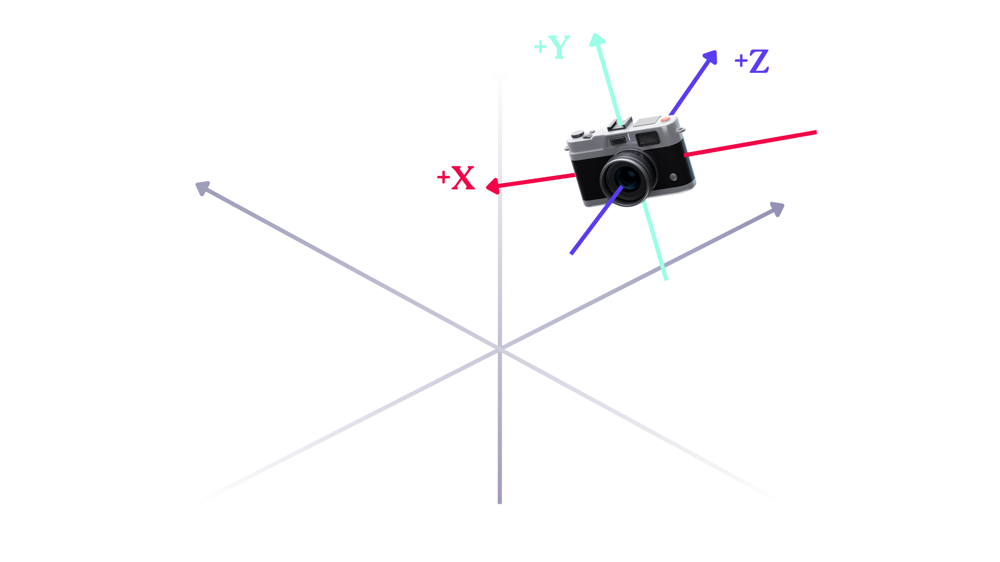

# Câmera

Luz, câmera, ação! São as 3 coisas que precisamos em uma aplicação gráfica, o resto é conversinha.

Você já deve ter percebido que até o momento atual as coisas estão meio... paradas? Nós temos colocado os objetos na frente da "câmera" do OpenGL mas é só isso, nós não temos a liberdade de mover ela por aí - de explorar os **cenários** e **UNIVERSOS** que criamos. Isso está prestes a mudar.

Neste capítulo, iremos brincar um pouco mais com os inputs do usuário (para quem estava com saudades do GLFW), e vamos não apenas fazer a câmera se mexer, mas também fazer ela dar mother fucking **_zoom_**. Os tópicos abordados serão:

1. Posicionando a câmera e seus eixos
2. A função `lookAt` do GLM
3. Movimentando a câmera
4. Ângulos de Euler para a rotação da câmera
5. Usando input do mouse para olhar ao redor
6. Usando o _scroll_ para dar zoom
7. Criando uma classe para nossa câmera

## Posicionando a câmera e seus eixos

Como vimos no capítulo de transformações, o ponto de vista câmera é o frame de referência do _view space_. Sendo assim, criar uma câmera é basicamente definir a sua **posição** (que será a **origem** do view space), e a **base** do espaço de visão (que está diretamente relacionado à direção para a qual a câmera está olhando).

Para facilitar nossa vida, também queremos que a base do espaço view space seja ortonormal (caso tenha esquecido o que isso significa, confira no capítulo de matemática). Ou seja, no fim o que teremos é algo assim:



Onde os eixos em branco são os eixos do _world space_, e os eixos coloridos são os eixos do espaço de visão que estamos construindo.

> Lembrando que o eixo Z aponta da câmera para você que está olhando para a tela. Os objetos que estão "atrás" da tela (na frente da câmera) possuem coordenada Z negativa. Ou melhor, objetos visíveis mais próximos da câmera possuem coordenada Z maior do que objetos distantes.

Chamaremos o vetor do eixo Z de **vetor de direção** (`D`). Já os vetores do eixo X e Y são os vetores para **direita** (`R`) e para **cima** (`C`), respectivamente, pois eles apontam para essas direções na perspectiva da câmera.

Partindo para o código, definir a posição da câmera é trivial, como já fizemos antes:

``` cpp
glm::vec3 posCamera = glm::vec3(0.0f, 0.0f, 5.0f);
```

Já para definir o vetor de direção da nossa câmera, determinaremos que ela começa olhando para algum alvo, neste caso a origem do espaço de mundo. Portanto, precisamos de um vetor normalizado (lembrando que a base será ortonormal) que aponte deste alvo diretamente para nossa câmera. Fazer isso é simples, nós subtraímos a posição da câmera pela posição do alvo, e então normalizamos.

``` cpp
glm::vec3 posAlvo = glm::vec3(0.0f, 0.0f, 0.0f);
glm::vec3 direcaoCamera = glm::normalize(posCamera - posAlvo);
```

Já para descobrir o vetor para a direita, precisamos usar um leve de um truque. Primeiro, criaremos um novo vetor que aponta diretamente para cima (`<0, 1, 0>`), mas atenção, este ainda não é nosso vetor `C`; o "cima" dele está no espaço de mundo. Depois, fazemos um produto vetorial entre esse novo vetor e `D` (nesta ordem) e o resultado, quando normalizado, será nosso vetor `R`. Para calcular o produto vetorial usamos a função `glm::cross`.

``` cpp
glm::vec3 cima = glm::vec3(0.0f, 1.0f, 0.0f); 
glm::vec3 direitaCamera = glm::normalize(glm::cross(cima, direcaoCamera));
```

É um pouco difícil ilustrar o por quê deste truque funcionar, mas o motivo basicamente é que - como vimos no capítulo de matemática - o produto vetorial gera um vetor ortogonal a ambos os operandos. Ou seja, mesmo que o vetor que aponta para "cima" aqui não seja ortogonal ao vetor de direção (não faça 90° com ele), o vetor da direita irá fazer 90° com **ambos**, que é o que importa nesse caso.

> Inverter a ordem dos operandos aqui no produto vetorial faria com que o nosso sistema de coordenadas deixasse de ser destro, pois `u × v = -(v × u)`.

Agora, com o vetor `D` e `R` em mãos, podemos obter o verdadeiro vetor do eixo Y da câmera. Diferentemente daquele usado no truque, este será ortogonal aos eixos X e Z. Como faremos isso? Acertou: com produto vetorial de novo:

``` cpp
glm::vec3 cimaCamera = glm::cross(direcaoCamera, direitaCamera);
```

## A função lookAt do GLM

Tendo construído o espaço de visão da nossa câmera, podemos usar os vetores da base desse espaço e a posição da câmera (`P`) para formar uma matriz que traduz qualquer vetor para este espaço - a matriz _view_. Essa matriz é formada assim:

``` 
┌             ┐   ┌           ┐
│Rx  Ry  Rz  0│   │1  0  0  Px│
│Cx  Cy  Cz  0│ × │0  1  0  Py│
│Dx  Dy  Dz  0│   │0  0  1  Pz│
│0   0   0   1│   │0  0  0  1 │
└             ┘   └           ┘
```

Contudo, para nossa alergia, basicamente tudo que vimos até agora é resolvido pela função `lookAt` do GLM. Esta função recebe como argumentos a posição da câmera, a posição do alvo para o qual ela está olhando, e aquele vetor que aponta para cima no world space que nós usamos no truque. Ou seja, podemos construir nossa matriz view dessa forma:

``` 
glm::mat4 view;
view = glm::lookAt(glm::vec3(0.0f, 0.0f, 3.0f), 
  	        	   glm::vec3(0.0f, 0.0f, 0.0f), 
  	        	   glm::vec3(0.0f, 1.0f, 0.0f));
```

Mamão com açucar.

## Movimentando a câmera

Obviamente, para movimentar a câmera, precisamos fazer com que sua posição mude ao longo do tempo. Nosso objetivo final é fazer com que o usuário consiga controlar o movimento. Mas, só para sentir um gostinho do resultado final, vejamos o que acontece se movermos a câmera em um caminho pré-determinado usando algumas funções matemáticas.

Coloque este código no loop de renderização e rode o programa novamente. Ele define um movimento circular ao redor da origem do world space, com uma leve subida e descida ondular também.

``` cpp
const float raio = 5.0f;
float camX = sin(glfwGetTime()) * raio;
float camY = sin(glfwGetTime());
float camZ = cos(glfwGetTime()) * raio;
glm::mat4 view;
view = glm::lookAt(glm::vec3(camX, 0.0, camZ), glm::vec3(0.0, 0.0, 0.0), glm::vec3(0.0, 1.0, 0.0));
```

> A função `glfwGetTime` retorna o tempo desde que o GLFW foi inicializado em segundos (em um `double`).

Muito bacana, nossa câmera finalmente está se mexendo! Se você estiver seguindo este capítulo passo a passo, tente brincar com os argumentos da função `lookAt` para ver como o movimento da câmera é afetado.

Agora, vamos fazer com que o usuário consiga mover a câmera com as teclas `WASD`. Primeiramente iremos colocar as variáveis que controlam a visão da nossa câmera no escopo global (acima do main), e mudar um pouco como o "alvo" da nossa câmera é determinado. O alvo agora será sempre um ponto que está um pouco a frente da posição da câmera, para que quando ela se mova o alvo se mova junto. Para que isso surta efeito, iremos mudar o segundo argumento da função `lookAt`.

``` cpp
// no topo do arquivo
glm::vec3 posCamera = glm::vec3(0.0f, 0.0f,  3.0f);
glm::vec3 direcaoCamera = glm::vec3(0.0f, 0.0f, -1.0f);
glm::vec3 cima = glm::vec3(0.0f, 1.0f,  0.0f);

// aonde estávamos definindo nosso vetor view
view = glm::lookAt(posCamera, posCamera + direcaoCamera, cima);
```

Depois, precisamos modificar nossa função `processaInput` para mudar a posição da câmera quando essas teclas forem apertadas:

``` cpp
void processaInput(GLFWwindow *window)
{
    ...

    const float velocidadeCam = 0.05f;
    if (glfwGetKey(window, GLFW_KEY_W) == GLFW_PRESS)
        posCamera += velocidadeCam * direcaoCamera;
    if (glfwGetKey(window, GLFW_KEY_S) == GLFW_PRESS)
        posCamera -= velocidadeCam * direcaoCamera;
    if (glfwGetKey(window, GLFW_KEY_A) == GLFW_PRESS)
        posCamera -= glm::normalize(glm::cross(direcaoCamera, cima)) * velocidadeCam;
    if (glfwGetKey(window, GLFW_KEY_D) == GLFW_PRESS)
        posCamera += glm::normalize(glm::cross(direcaoCamera, cima)) * velocidadeCam;
}
```

Contudo, tratando o movimento da forma que estamos tratando agora, sua velocidade estará atrelada à **_framerate_** do nosso programa, ou seja, a quantos **fps** ele está rodando. Esse é um erro bem manjado no desenvolvimento de jogos, e ocorre pois nós estamos atualizando a posição por um valor fixo a cada frame, independentemente do quanto ele demorou para renderizar. Logo, em um computador mais potente - que renderiza mais frames por segundo - a câmera se moverá mais vezes, e portanto terá maior velocidade.

Para corrigir este erro, vamos ter que criar uma variável de **_delta time_** (`dt`) para armazenar quanto tempo se passou entre o último frame e o atual. Com isso, simplesmente multiplicaremos a velocidade da nossa câmera por `dt` antes de movê-la.

No escopo global, crie essas duas variáveis:

``` cpp
float dt = 0.0f;
float ultimoTempo = 0.0f;
```

No inicinho do loop de renderização, adicione a lógica que atualiza o `dt`:

``` cpp
float tempoAtual = glfwGetTime();
dt = tempoAtual - ultimoTempo;
ultimoTempo = tempoAtual;  
```

E no `processaInput`, mude a forma como calculamos a velocidade da câmera:

``` cpp
float velocidadeCam = 2.5f * dt;
```

Rode o programa novamente e você perceberá... nada, provavelmente. Mas acredite, o erro foi embora.

## Ângulos de Euler para a rotação da câmera

Como nós temos 3 eixos no view space, podemos pensar em 3 tipos de rotação, uma em cada eixo. Cada uma dessas rotações é representada por um **ângulo de Euler**: o **_pitch_**, o **_yaw_** e o **_roll_**, que rotacionam um objeto ao redor dos eixos X, Y e Z, respectivamente.


Tendo estes ângulos, conseguimos com relativa facilidade construir o vetor de direção da nossa câmera. Na imagem abaixo, a figura à esquerda é uma visão olhando de cima para baixo o plano XZ, nos mostrando que os componentes `x` e `z` do vetor de direção são proporcionais ao cosseno e o seno do ângulo _yaw_, respectivamente. Já a figura à direita nos mostra que o componente `y` é o seno do ângulo _pitch_, e que o cosseno deste ângulo também afeta os componentes `x` e `y`.


Sendo assim, a fórmula para calcular nosso vetor de direção é a seguinte:

``` cpp
direcaoCamera.x = cos(glm::radians(yaw)) * cos(glm::radians(pitch));
direcaoCamera.y = sin(glm::radians(pitch));
direcaoCamera.z = sin(glm::radians(yaw)) * cos(glm::radians(pitch));
```

## Usando input do mouse para olhar ao redor

Se você já utilizou um computador, deve saber que geralmente controlamos a direção para qual a câmera de um software está apontando com o **_mouse_**. E se você prestou atenção na trilha até aqui, já tá sabido de que estamos usando o GLFW para lidar com inputs do usuário - então vamos direto para a ação.

Primeiro, vamos fazer com que o GLFW capture seu mouse quando você dê foco ao programa, e que ele não renderize o ponteiro do mouse. Isso é feito através da função `glfwSetInputMode`.

``` cpp
glfwSetInputMode(window, GLFW_CURSOR, GLFW_CURSOR_DISABLED);
```

Depois, assim como fizemos com o teclado, vamos adicionar uma função de callback que lide com os inputs del ratón:

``` cpp
// no topo do arquivo
void callback_mouse(GLFWwindow* janela, double posX, double posY);

// variaveis globais que vamos usar no callback
bool primeiroInputMouse = true;
float ultimoX = 400, ultimoY = 300;
float pitch = 0.0f;
float yaw = -90.0f;
float roll = 0.0f;

// na função main
glfwSetCursorPosCallback(window, callback_mouse);

// depois da função main
void callback_mouse(GLFWwindow* janela, double posX, double posY)
{
    if (primeiroInputMouse) {
        ultimoX = posX;
        ultimoY = posY;
        primeiroInputMouse = false;
    }
  
    float offsetX = posX - ultimoX;
    float offsetY = ultimoY - posY; 
    ultimoX = posX;
    ultimoY = posY;

    float sensitividade = 0.1f;
    offsetX *= sensitividade;
    offsetY *= sensitividade;

    yaw   += offsetX;
    pitch += offsetY;

    if(pitch > 89.0f)
        pitch = 89.0f;
    if(pitch < -89.0f)
        pitch = -89.0f;

    glm::vec3 direcao;
    direcao.x = cos(glm::radians(yaw)) * cos(glm::radians(pitch));
    direcao.y = sin(glm::radians(pitch));
    direcao.z = sin(glm::radians(yaw)) * cos(glm::radians(pitch));
    direcaoCamera = glm::normalize(direcao);
}
```

É bastante código, então vamos com calma.

Nos primeiros trechos, estamos simplesmente declarando o protótipo da função de callback, as variáveis globais das quais precisamos (como os ângulos de Euler e a posição do mouse) e linkando essa função com o GLFW. A parada interessante está, é claro, no próprio callback.

Quando é chamada, esta função recebe a posição atual do mouse, e então segue a seguinte lógica:

1. Se for o primeiro movimento do mouse, define a "posição anterior" dele para ser a posição atual. Fazemos isso para que não precisemos definir uma posição inicial arbitrária, que causaria um abrupto salto na direção da câmera quando a verdadeira posição do mouse fosse capturada.
2. Definimos a mudança de direção como sendo a diferença entre a posição anterior e a atual. O `offsetY` é invertido pois as coordenadas do mouse na janela do GLFW possui origem no topo superior esquerdo, mas queremos que quando o mouse se mova para cima (`posY > ultimoY`) o pitch aumente.
3. Nós então utilizamos uma variável "sensibilidade" para controlar a proporção entre o tamanho do movimento do mouse e o tamanho da mudança no ângulo da câmera.
4. Definimos o yaw e o pitch, limitando este último para que não passe de +-89°. Essa limitação é importante para que, quando o usuário mova muito o mouse verticalmente, a visão dele não "flippe" para o sentido oposto, deixando o mundo de ponta cabeça. Isso também é de certa forma realista, pois a não ser que você esteja fazendo grandes e perigosas acrobacias, seu pescoço não consegue sozinho olhar para cima ao ponto de você acabar olhando para trás.
5. Por fim, nós construímos o vetor de direção usando a fórmula na qual chegamos na seção anterior. Note, contudo, o uso das funções `glm::radians` e `glm::normalize`, elas são importantes.

Pronto, rodando o programa com essas modificações você será capaz não só de se mover pelo espaço, mas também de olhar para onde você quiser - **yeah science!!**

## Usando o _scroll_ para dar zoom

Esta adição vai ser relativamente básica. O que precisamos fazer é mudar o **_FOV_** (campo de visão) da câmera, que é definido na nossa matriz de projeção de perspectiva. Quanto menor o FOV, maior será a impressão de zoom - de proximidade com objetos distantes - pois o espaço capturado pela câmera será menor, e portanto "esticado" para preencher a tela. Ou seja, nós veremos menos coisas, mas elas ocuparão um espaço maior na tela, dando o efeito de zoom.

Para isso, usaremos novamente uma função de callback:

``` cpp
// no topo do arquivo
void callback_scroll(GLFWwindow* window, double offsetX, double offsetY);

// variável global do controle do FOV
float FOV = 45.0f;

// linkando o callback com o GLFW, no main
glfwSetScrollCallback(window, callback_scroll);

// passando o FOV para a matriz de projeção, no loop de renderização
projection = glm::perspective(glm::radians(FOV), 800.0f / 600.0f, 0.1f, 100.0f);

// definindo a função de callback no fim do arquivo
void callback_scroll(GLFWwindow* window, double offsetX, double offsetY) {
    FOV -= (float)offsetY;
    if (FOV < 1.0f)
        FOV = 1.0f;
    if (FOV > 60.0f)
        FOV = 60.0f; 
}
```

No callback, o argumento `offsetY` nos diz o quanto o scroll rolou verticalmente. Estamos também limitando o FOV entre `1°` e `60°`, mas você pode mudar esses valores e ver no que dá.

## Criando uma classe para nossa câmera

Da mesma forma que fizemos com os shaders, bora criar uma classe que abstraia o funcionamento interno da câmera, só para tornar nosso arquivo principal mais legível e nosso projeto mais organizado.

Primeiro, crie os arquivos `camera.hpp` e `camera.cpp` na pasta `modules`, que nem fizemos da outra vez. No arquivo de header, coloque este código com a declaração da classe:

``` cpp
#ifndef CAMERA_H
#define CAMERA_H

#include <glad/glad.h>
#include <glm/glm.hpp>
#include <glm/gtc/matrix_transform.hpp>

enum Camera_Movement { FRENTE, TRAS, ESQUERDA, DIREITA };

// Valores iniciais padrão
const float YAW = -90.0f;
const float PITCH = 0.0f;
const float VELOCIDADE = 2.5f;
const float SENSITIVIDADE = 0.05f;
const float ZOOM = 45.0f;

class Camera {
public:
  glm::vec3 Posicao;
  glm::vec3 Direcao;
  glm::vec3 Cima;
  glm::vec3 Direita;
  glm::vec3 CimaMundo;
  float Yaw;
  float Pitch;
  float Velocidade;
  float Sensitividade;
  float Zoom;

  // Construtor com alguns valores padrões
  Camera(glm::vec3 posicao = glm::vec3(0.0f, 0.0f, 0.0f),
         glm::vec3 cima = glm::vec3(0.0f, 1.0f, 0.0f), float yaw = YAW,
         float pitch = PITCH);

  // Função que forma a matriz view
  glm::mat4 MatrizView();
  // Callbacks de movimento e zoom
  void ProcessaTeclado(Camera_Movement direction, float deltaTime);
  void ProcessaMovimentoMouse(float offsetX, float offsetY,
                              GLboolean limitarPitch = true);
  void ProcessaScroll(float offsetY);

private:
  // Recalcula os vetores de direção, direita e cima de
  // acordo com os ângulos de Euler
  void atualizaEixos();
};
#endif
```

Já no outro arquivo, coloque a definição dos métodos:

``` cpp
#include "camera.hpp"

Camera::Camera(glm::vec3 posicao, glm::vec3 cima, float yaw, float pitch)
    : Direcao(glm::vec3(0.0f, 0.0f, -1.0f)), Velocidade(VELOCIDADE),
      Sensitividade(SENSITIVIDADE), Zoom(ZOOM) {
  Posicao = posicao;
  CimaMundo = cima;
  Yaw = yaw;
  Pitch = pitch;
  atualizaEixos();
}

glm::mat4 Camera::MatrizView() {
  return glm::lookAt(Posicao, Posicao + Direcao, Cima);
}

void Camera::ProcessaTeclado(Camera_Movement direcao, float deltaTime) {
  float vel = Velocidade * deltaTime;
  if (direcao == FRENTE)
    Posicao += Direcao * vel;
  if (direcao == TRAS)
    Posicao -= Direcao * vel;
  if (direcao == ESQUERDA)
    Posicao -= Direita * vel;
  if (direcao == DIREITA)
    Posicao += Direita * vel;
}

void Camera::ProcessaMovimentoMouse(float offsetX, float offsetY,
                                    GLboolean limitarPitch) {
  offsetX *= Sensitividade;
  offsetY *= Sensitividade;

  Yaw += offsetX;
  Pitch += offsetY;

  if (limitarPitch) {
    if (Pitch > 89.0f)
      Pitch = 89.0f;
    if (Pitch < -89.0f)
      Pitch = -89.0f;
  }

  atualizaEixos();
}

void Camera::ProcessaScroll(float offsetY) {
  Zoom -= (float)offsetY;
  if (Zoom < 1.0f)
    Zoom = 1.0f;
  if (Zoom > 60.0f)
    Zoom = 60.0f;
}

void Camera::atualizaEixos() {
  glm::vec3 direcao;
  direcao.x = cos(glm::radians(Yaw)) * cos(glm::radians(Pitch));
  direcao.y = sin(glm::radians(Pitch));
  direcao.z = sin(glm::radians(Yaw)) * cos(glm::radians(Pitch));
  Direcao = glm::normalize(direcao);
  Direita = glm::normalize(glm::cross(direcao, CimaMundo));
  Cima = glm::normalize(glm::cross(Direita, direcao));
}
```

Não prolongarei o capítulo explicando cada função pois nós já vimos como chegar em cada uma delas, isso aqui é só uma separação do código que escrevemos nas últimas horas (?) em funções mais manuseáveis.

Para finalizar, é só fazer as alterações necessárias no main:

``` cpp
// de todas aquelas variáveis globais que criamos, só ficam essas
Camera camera(glm::vec3(0.0f, 0.0f, 5.0f));
bool primeiroInputMouse = true;
float ultimoX = 400, ultimoY = 300;
float dt = 0.0f;
float ultimoTempo = 0.0f;

// a criação da matriz view fica assim
view = camera.MatrizView();

// e a da matriz projection assim
projection = glm::perspective(glm::radians(camera.Zoom), 800.0f / 600.0f, 0.1f, 100.0f);

// o callback que processa inputs do teclado precisa mudar
void processaInput(GLFWwindow *window) {
    if (glfwGetKey(window, GLFW_KEY_ESCAPE) == GLFW_PRESS)
        glfwSetWindowShouldClose(window, true);

    if (glfwGetKey(window, GLFW_KEY_W) == GLFW_PRESS)
        camera.ProcessaTeclado(FRENTE, dt);
    if (glfwGetKey(window, GLFW_KEY_S) == GLFW_PRESS)
        camera.ProcessaTeclado(TRAS, dt);
    if (glfwGetKey(window, GLFW_KEY_A) == GLFW_PRESS)
        camera.ProcessaTeclado(ESQUERDA, dt);
    if (glfwGetKey(window, GLFW_KEY_D) == GLFW_PRESS)
        camera.ProcessaTeclado(DIREITA, dt);
}

// assim como o do mouse
void callback_mouse(GLFWwindow *janela, double posXin, double posYin) {
    float posX = static_cast<float>(posXin);
    float posY = static_cast<float>(posYin);

    if (primeiroInputMouse) {
        ultimoX = posX;
        ultimoY = posY;
        primeiroInputMouse = false;
    }

    float offsetX = posX - ultimoX;
    float offsetY = ultimoY - posY;

    ultimoX = posX;
    ultimoY = posY;

    camera.ProcessaMovimentoMouse(offsetX, offsetY);
}

// ... e também o do scroll
void callback_scroll(GLFWwindow *window, double offsetX, double offsetY) {
    camera.ProcessaScroll(static_cast<float>(offsetY));
}
```

Caso você tenha se perdido em algum momento, o código final do capítulo está na pasta `codigos/` do nosso repositório, como sempre.

## Conclusão

Mexer com a câmera é um trabalho um pouco cansativo, mas pelo menos é algo que costumamos fazer uma vez só - quando tá pronto tá pronto. Enfim, não sei como concluir este capítulo e atualmente são 3 e poucas da manhã, então obrigado por ler até aqui e até o próximo capítulo :)

```
         _\|/_
         (o o)
 +----oOO-{_}-OOo--------------------+
 |                                   |
 | E isso é tudo p-pe-pe-pe-pessoal! |
 |                                   |
 +-----------------------------------+
```

## Exercícios propostos

1. Tente fazer com que pressionar `Q` e `E` mude o **_roll_** da câmera, para que ela se incline para a esquerda e para a direita.
2. Implemente a função `lookAt` você mesmo para criar a matriz view seguindo a fórmula que nós vimos. Use ela no lugar do GLM e veja se o resultado é o mesmo. 
